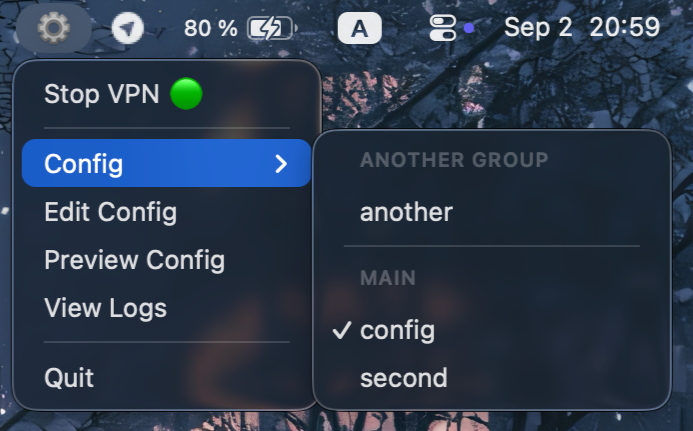
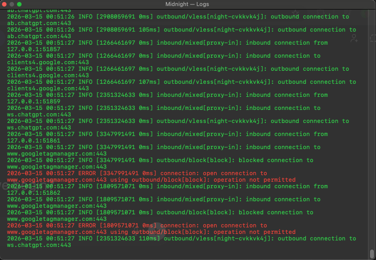

# Midnight VPN — macOS

## Description
**A native macOS menu bar app for running `sing-box` (v1.13+).** <br>
**The app lives in the menu bar with no Dock icon and provides the following:**
- **Start / Stop VPN**
- **Switch config**
- **View live logs**
- **Edit config**
- **Preview built config**
- **Quit**

### Screenshots:

### Tray



### Logs



## Sharing pieces between configs
> Currently only supported for `macos`

Configs in `configs/` can be either fully standalone, or pull shared pieces (outbounds, dns, route) from the `sources/` folder next to it. Handy when you have several configs with different servers but the same rules.

- **`"$extends": ["file.json#key:target"]`** — placed at the top of a config, pulls in a piece from `sources/`: `file.json` is which file, `key` is which key inside it to take, `target` is what name to place it under in the final config (omit it to keep the same name as `key`).
- **`"$ref:file.json#key"`** — can be used as the value of any field inside a rule (e.g. instead of a list of domains/IPs), and it gets replaced with the array from `sources/`. That way the same list (your IPs, your domains) doesn't need to be copy-pasted into every config.

The final (built) config is saved to `~/Library/Application Support/Midnight/build/` and that's what actually gets passed to `sing-box`. You can see the result via **`Preview Config`** in the tray.

An example of a config split this way is available in [`docs/examples`](docs/examples).

## Requirements

- **macOS 13+**
- **[sing-box](https://github.com/SagerNet/sing-box) installed via Homebrew:**
```bash
brew install sing-box
```

## Setup

**1. Open Midnight.dmg and drag it to Applications** <br>

**2. Place your config in the folder:** <br>
`~/Library/Application Support/Midnight/configs/config.json`

**3. Allow sing-box to run without password — add path to sudoers: (`sudo visudo`)** <br>
`your_username ALL=(ALL) NOPASSWD: /opt/homebrew/bin/sing-box`

**4. Launch the application:** <br>
`open Midnight.app` or via `Finder`

On first launch macOS may block the app.
Go to **System Settings → Privacy & Security → Open Anyway**.

## Auto-start at login

**System Settings → General → Login Items → add `Midnight.app`**

## Build from source
If you need to modify the source code, you can rebuild `Midnight.app`:
```bash
# default certificate name is MidnightDev

# build Midnight.app with the MidnightDev certificate
./build.sh

# build Midnight.app with your own certificate
./build.sh --cert "Certificate Name"

# build and package into dmg
./build.sh --cert "Certificate Name" --package
```

The script compiles the app, creates `Midnight.app` and packages it into `Midnight.dmg`.
