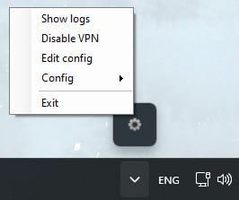
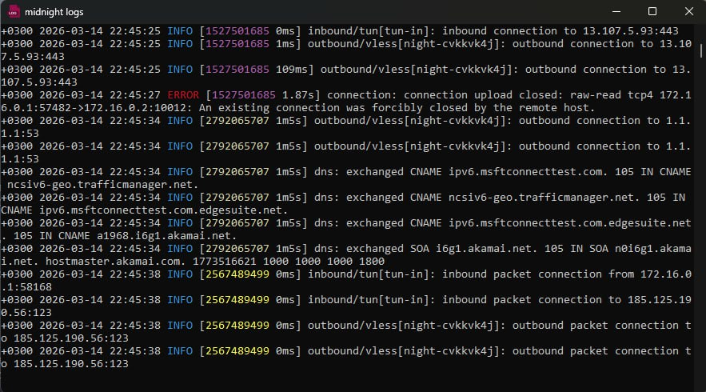

# Midnight VPN

## Описание
**Исполняемый файл (`.exe`) для запуска `sing-box.exe` (v1.13+) с расширенными возможностями.**
**При запуске приложение сворачивается в трей и предоставляет следующее API:**
- **Показать/Скрыть логи**
- **Включить/Выключить vpn**
- **Отредактировать конфиг**
- **Сменить текущий конфиг**
- **Выйти из клиента (завершить процесс)**

### Вот как это выглядит:

### Трей



### Логи



## Старт

**1. Устанавливаем приложение через мастер установок** <br>

**2. Кладём конфиг в папку приложения:** <br>
`C:\Program Files\Midnight\Core\config.json`

**3. Запускаем приложение `(обязательно с правами администратора)`:** <br>
`midnight.exe` или через `Проводник`

## Автозапуск при входе

**Доступно при установке — отметьте соответствующий пункт, чтобы добавить задачу в Планировщик заданий.**

## Компиляция:
Если по каким-либо причинам придётся изменить исходный код приложения, то можно пересобрать `midnight.exe`: 

```bash
# собрать midnight.exe
.\build.ps1

# собрать midnight.exe + создать MidnightSetup.exe
.\build.ps1 -Package
```
